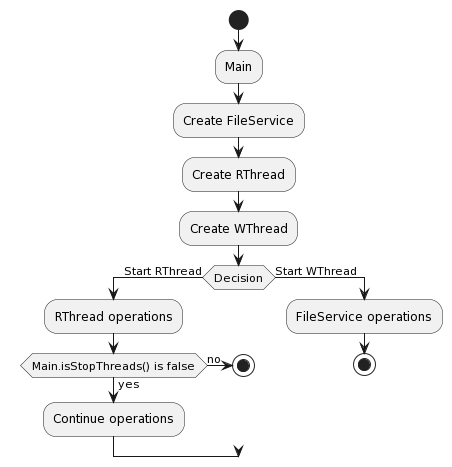
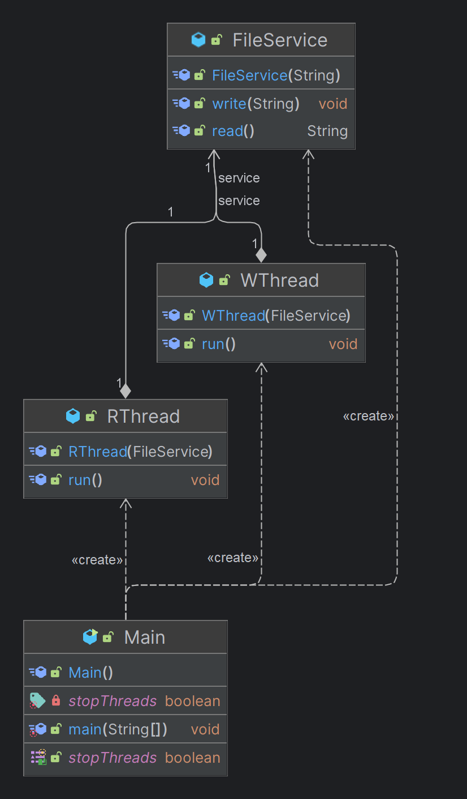
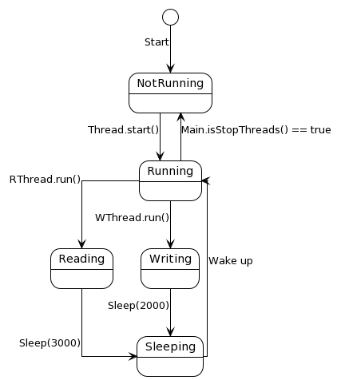

# Exercise1

This package contains a simple multi-threaded application that simulates a reader-writer scenario using Java threads. The application consists of two types of threads: a reader thread (`RThread`) and a writer thread (`WThread`). Both threads interact with a shared resource, `FileService`, to read and write messages.

## Activity Diagram

The activity diagram provides a graphical representation of the flow of control or object flow in the application. It visualizes the sequence of activities and the conditions for their execution. The diagram for this package illustrates the activities involved in reading and writing messages to a file.

## Class Diagram

The class diagram provides a static structure of all the classes that are part of this package. It shows the classes (`Main`, `RThread`, `WThread`, `FileService`), their attributes, methods, and the relationships among objects. The class diagram for this package helps to understand the object-oriented design of the application.

## State Machine Diagram

The state machine diagram describes the behavior of the `RThread` and `WThread` objects over time. It shows the different states of an object, the events that cause a transition from one state to another, and the actions that result from a state change. The state machine diagram for this package helps to understand the lifecycle of the threads and their interaction with the `FileService`.

