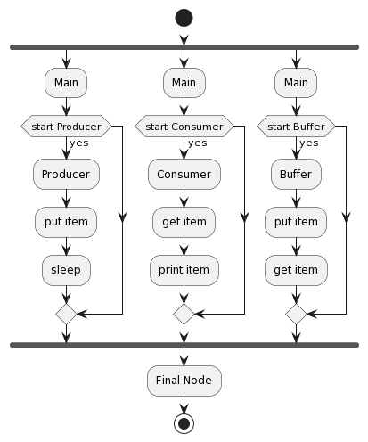
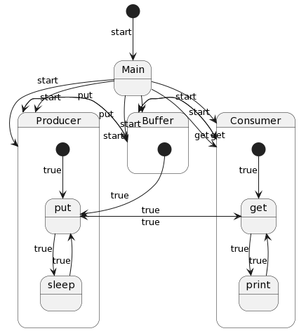

# Exercise2

This package contains another multi-threaded application that simulates a different scenario using Java threads. The application consists of multiple threads interacting with shared resources.

## Activity Diagram

The activity diagram provides a graphical representation of the flow of control or object flow in the application. It visualizes the sequence of activities and the conditions for their execution. The diagram for this package illustrates the activities involved in the application.

## State Machine Diagram

The state machine diagram describes the behavior of the objects over time. It shows the different states of an object, the events that cause a transition from one state to another, and the actions that result from a state change. The state machine diagram for this package helps to understand the lifecycle of the threads and their interaction with the shared resources.

