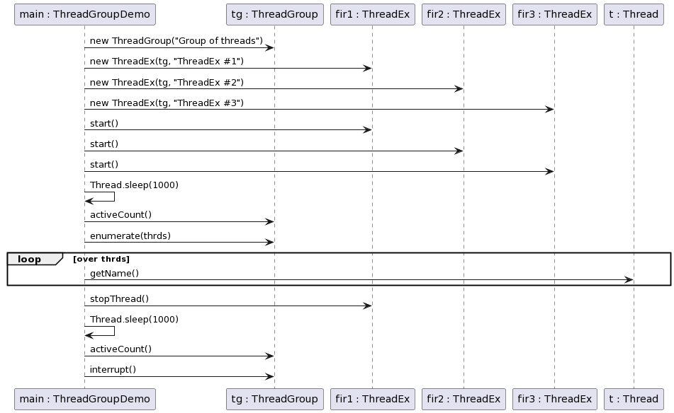
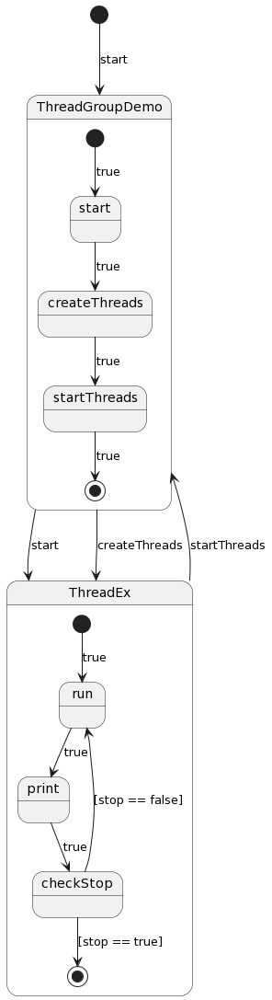

# Exercise4

This package contains a multi-threaded application that simulates a unique scenario using Java threads. The application
consists of several threads interacting with shared resources.

## Sequence Diagram

The sequence diagram shows the interaction between objects in a sequential order. It visualizes the sequence of
operations in the application and the messages exchanged between objects. The diagram for this package illustrates the
sequence of operations involved in the application.

## State Machine Diagram

The state machine diagram describes the behavior of the objects over time. It shows the different states of an object,
the events that cause a transition from one state to another, and the actions that result from a state change. The state
machine diagram for this package helps to understand the lifecycle of the threads and their interaction with the shared
resources.

