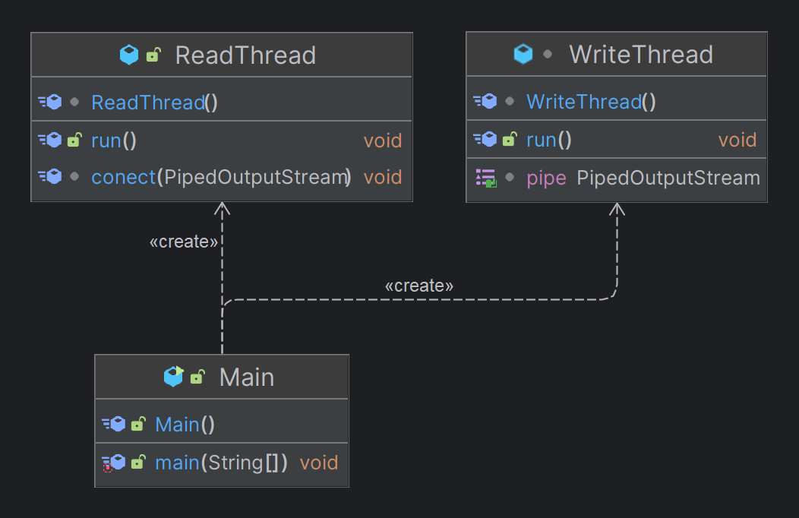
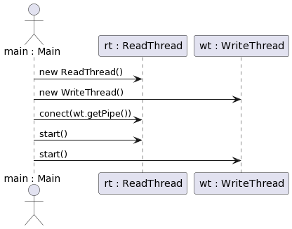

# Exercise5

This package contains a multi-threaded application that simulates a unique scenario using Java threads. The application consists of several threads interacting with shared resources.

## Class Diagram

The class diagram provides a static structure of all the classes that are present within the system. It shows the attributes and methods of each class, the relationships and dependencies between classes. The class diagram for this package helps to understand the structure of the code.

## Communication Diagram

The communication diagram shows the interaction between objects in terms of sequenced messages. It visualizes how messages and information are sent back and forth between objects over time in the application. The communication diagram for this package helps to understand the sequence of calls and messages between objects.

